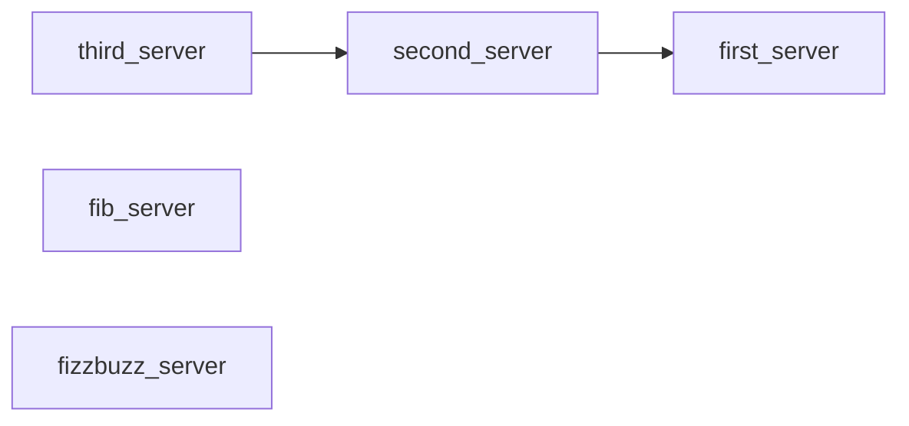
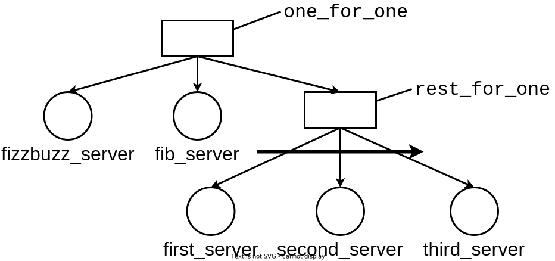

# bean demo project

This project is a simple demonstration of bean.

## gen_servers and the supervision tree automatically generated for them

In this project, gen_servers are defined in [src/gen_servers](src/gen_servers) directory. The following figure shows the dependencies of the gen_servers:

Then bean generates the supervision tree shown in the following figure:

